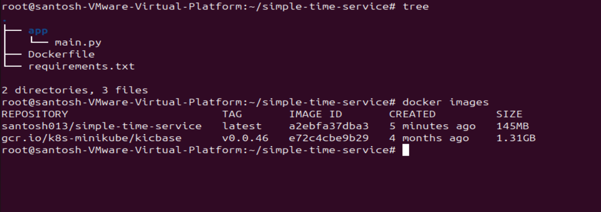
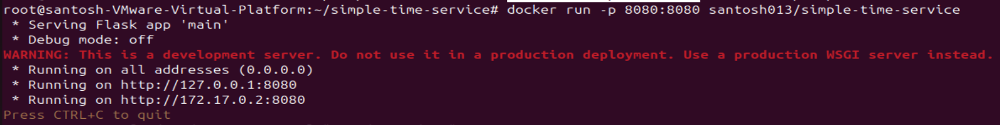
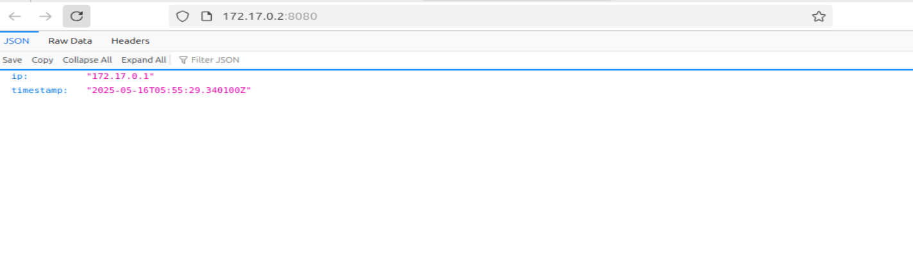

# 🕒 SimpleTimeService

**SimpleTimeService** is a minimalist web microservice that returns the current UTC timestamp and the IP address of the client making the request.

---

## 🚀 Features

- Returns current UTC timestamp in ISO 8601 format.
- Returns client IP address.
- Lightweight and containerized.
- Runs as a non-root user inside the Docker container.

---
## Project Structure
simple-time-service/
│
├── app/
│   └── main.py
│
├── Dockerfile
├── .dockerignore
├── requirements.txt
└── README.md


## 📦 Docker Quickstart

### 🔧 Build the Docker Image

### SimpleTimeService

A minimal microservice that returns the current UTC timestamp and your IP address.

## 🔧 How to Build and Run

### Docker Build

```bash
docker build -t santosh013/simpletimeservice .
```


### Run docker container
```bash
docker run -p 8080:8080 santosh013/simpletimeservice
```




### Docker image is public now anyone can use it.